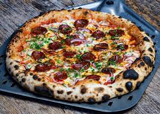
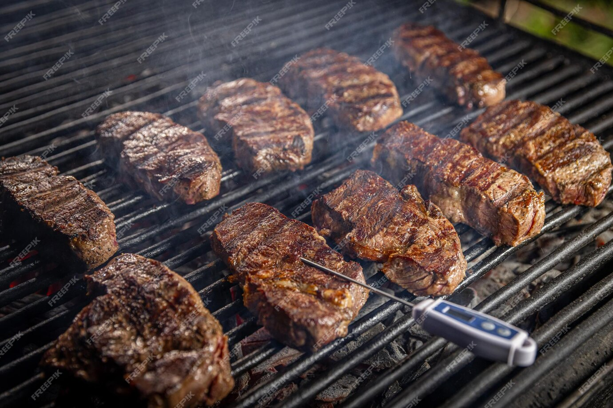

# 🍕 Abhii Restaurant Website

Welcome to **Abhii Restaurant**, a modern and responsive restaurant website showcasing flame-grilled dishes, wood-fired pizzas, and an authentic dining experience.


---

## 🔥 Live Demo

👉 [View Live Website](https://your-live-link-here.com)  
👉 [GitHub Repository](https://github.com/Abhisheksingh555/Pizza_Restaurant_UI)

---

## 📌 Project Features

- ✅ Responsive layout with semantic HTML5 structure
- ✅ Navigation with ARIA accessibility
- ✅ Font Awesome social media icons
- ✅ SEO-optimized `<meta>` tags
- ✅ Multiple themed sections:
  - Hero Section
  - About Us
  - Featured Menu
  - CEO’s Message
  - Why Choose Us
  - Contact Info
  - Footer with Quick Links & Social Icons

---

## 🌐 Tech Stack

| Tech            | Description                            |
|-----------------|----------------------------------------|
| `HTML5`         | Structure and content                  |
| `CSS3`          | Styling and layout                     |
| `Bootstrap 5.3` | Responsive grid and utilities          |
| `Font Awesome`  | Icons for social & feature highlights  |

---


---

## 📸 Screenshots

| Hero Section | Menu Section |
|--------------|--------------|
|  |  |

---

## 🚀 Getting Started

### 1. Clone the Repository

```bash
git https://github.com/Abhisheksingh555/Pizza_Restaurant_UI.git
cd Pizza_Restaurant_UI


